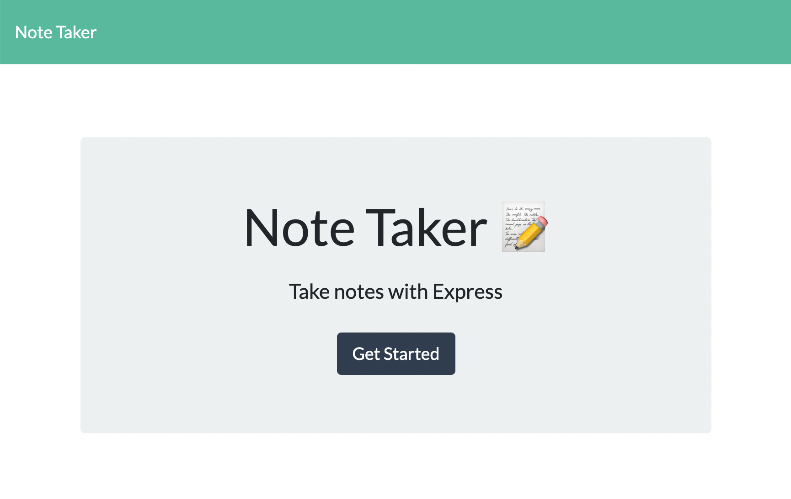

# Note Taker Starter Code
Create a website that gives the user the ability to add notes.

## Description
* Must be able to add notes
* Must be able to save notes
* Shows a save icon
* Shows an add icon

## Assets
The following shows what the website should look like:
 (./images/notetitle.jpg)
Heroku link: https://secret-citadel-81998.herokuapp.com/